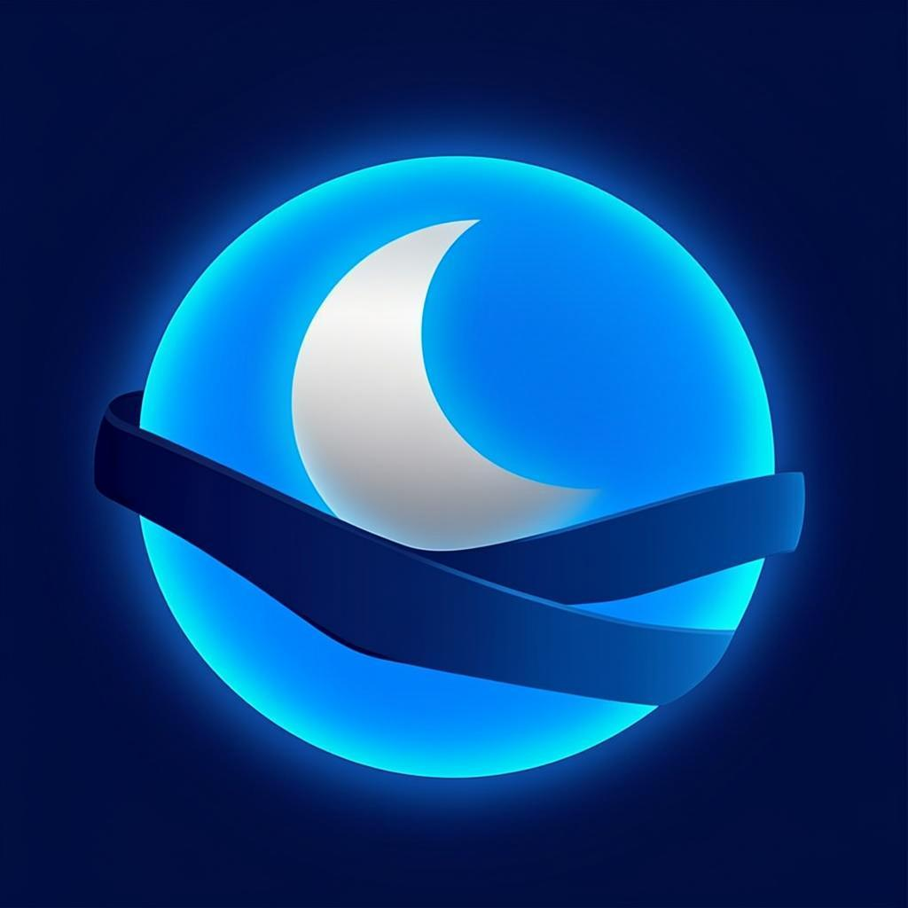

# 🌀 GojoXNG

<div align="center">



**محرك بحث خاص يحترم الخصوصية** · **Privacy-respecting metasearch engine**

مبني على [SearXNG](https://github.com/searxng/searxng) · مرخص AGPL-3.0-or-later


</div>

---

## ✨ المميزات | Features

- 🔒 **خصوصية كاملة** — لا تتبع، لا تخزين لسجل البحث، لا ملفات تعريف ارتباط للتصنت
- 🌀 **شعار GojoXNG الأصلي** — تصميم أنمي أصلي بأسلوب الساحر
- 🎨 **ستايل داكن مميز** — توهج نيوني أزرق على خلفية فضائية داكنة مع تأثيرات زجاجية
- 🚫 **بدون إعلانات أو تتبع** — محرك بحث مفتوح المصدر
- 🌐 **ميتا-بحث** — يجمع النتائج من محركات بحث متعددة (Google, Bing, DuckDuckGo, وغيرها)
- 🚆 **جاهز لـ Railway** — ملفات `nixpacks.toml` و `railway.json` مضمنة، يعمل على PORT 8080
- 🐳 **جاهز لـ Docker** — `Dockerfile` و `docker-compose.yml` مع Valkey

---

## 🚀 النشر على Railway (الطريقة الموصى بها)

### الخطوة 1: ارفع المستودع إلى GitHub
المستودع متاح على: **https://github.com/mkj555m5/gojoxng**

### الخطوة 2: اربطه بـ Railway
1. اذهب إلى [railway.app](https://railway.app) → **New Project**
2. اختر **Deploy from GitHub repo**
3. اختر مستودع `gojoxng`
4. سيكتشف Railway ملف `nixpacks.toml` تلقائياً

### الخطوة 3: اضبط متغيرات البيئة
في تبويب **Variables** في Railway، أضف:

| Variable | Value | مطلوب |
|----------|-------|-------|
| `SEARXNG_SECRET` | `openssl rand -hex 32` | ✅ نعم |
| `SEARXNG_BASE_URL` | `https://your-app.up.railway.app/` | ✅ نعم (بعد النشر الأول) |
| `SEARXNG_BIND_ADDRESS` | `0.0.0.0` | ✅ نعم |
| `SEARXNG_IMAGE_PROXY` | `true` | اختياري |
| `SEARXNG_METHOD` | `POST` | اختياري |

> **ملاحظة**: Railway يضبط `PORT` تلقائياً. التطبيق يستمع على `${PORT:-8080}`.

### الخطوة 4: افتح الموقع
1. في تبويب **Settings** → **Networking** → **Generate Domain**
2. ستحصل على رابط مثل `https://gojoxng-production.up.railway.app`
3. حدّث `SEARXNG_BASE_URL` بهذا الرابط

---

## 🐳 التشغيل المحلي بـ Docker

```bash
# 1. إعداد المتغيرات
cp .env.example .env
# عدّل .env — استخدم مفتاح سري قوي

# 2. تشغيل
docker compose up -d --build

# 3. افتح المتصفح
# http://localhost:8080
```

---

## 🎨 الستايل المميز

GojoXNG يأتي بستايل داكن مميز مع:

- **خلفية فضائية داكنة** مع توهجات زرقاء وبنفسجية
- **شعار بتوهج نيوني متحرك** (animation pulse)
- **بطاقات نتائج زجاجية** (glass morphism) مع backdrop-filter
- **نجوم متحركة** في الخلفية
- **شريط تمرير متوهج** بألوان متدرجة
- **روابط ومؤشرات بتوهج سماوي**

ملف الستايل: `searx/static/themes/simple/gojoxng-theme.css`

---

## 🔒 ميزات الخصوصية المفعّلة

| الميزة | الحالة | الوصف |
|--------|--------|--------|
| `image_proxy` | ✅ مفعّل | تمرير الصور عبر الخادم لإخفاء عنوان IP |
| `method: POST` | ✅ مفعّل | إخفاء استعلامات البحث من سجلات الخادم |
| `enable_metrics` | ❌ معطّل | لا تسجيل إحصائيات الاستخدام |
| `query_in_title` | ❌ معطّل | عدم وضع استعلام البحث في عنوان الصفحة |
| `Referrer-Policy` | ✅ no-referrer | لا إرسال معلومات المصدر |
| `X-Robots-Tag` | ✅ noindex, nofollow | منع فهرسة نتائج البحث |
| `Permissions-Policy` | ✅ مفعّل | تعطيل الكاميرا/الميكروفون/الموقع |
| `X-Frame-Options` | ✅ SAMEORIGIN | منع النقر التطفلي |

---

## 📁 بنية المشروع

```
gojoxng/
├── nixpacks.toml              # ⭐ إعداد Railway (Nixpacks)
├── railway.json               # ⭐ إعداد Railway
├── Dockerfile                 # صورة Docker
├── docker-compose.yml         # Docker Compose مع Valkey
├── .env.example               # قالب المتغيرات البيئية
├── nginx-gojoxng.conf         # إعداد Nginx للوكيل العكسي
├── Caddyfile                  # بديل Caddy مع HTTPS تلقائي
├── README-GOJOXNG.md          # دليل النشر الكامل
├── config/
│   └── settings.yml           # إعدادات GojoXNG المنشورة
├── container/
│   ├── entrypoint.sh          # نقطة دخول Docker
│   └── settings.template.yml  # قالب الإعدادات
└── searx/                     # الكود المصدري (SearXNG fork)
    ├── settings.yml           # الإعدادات الافتراضية
    ├── templates/simple/      # قوالب HTML المخصصة
    │   ├── base.html          # ✏️ تم تعديله للعلامة التجارية
    │   ├── index.html         # ✏️ الشعار في الصفحة الرئيسية
    │   └── search.html        # ✏️ الشعار في صفحة النتائج
    └── static/themes/simple/
        ├── gojoxng-theme.css  # ⭐ الستايل المميز الجديد
        └── img/
            ├── gojoxng-logo.png       # الشعار (من favicon)
            └── gojoxng-favicon.png    # الفافيكون
```

---

## 🛠️ أوامر مفيدة

```bash
# تشغيل محلي بدون Docker
python3 -m venv .venv
source .venv/bin/activate
pip install -r requirements.txt granian[pname]==2.7.9
export SEARXNG_SECRET=$(openssl rand -hex 32)
granian searx.webapp:app --host 0.0.0.0 --port 8080 --interface wsgi

# Docker
docker compose up -d --build      # تشغيل
docker compose logs -f            # السجلات
docker compose down               # إيقاف
```

---

## ❓ استكشاف الأخطاء

**الصفحة لا تتحمل على Railway؟**
- تأكد أن `SEARXNG_BIND_ADDRESS=0.0.0.0`
- تحقق من السجلات في تبويب **Deployments**

**لا تظهر نتائج البحث؟**
- بعض محركات البحث تحظر عناوين IP الخاصة بمراكز البيانات
- هذا طبيعي على Railway/VPS — جرّب إضافة بروكسي صادر

**الشعار لا يظهر؟**
- تحقق من مسار الملف: `searx/static/themes/simple/img/gojoxng-logo.png`

---

## 📄 الترخيص

GojoXNG مبني على SearXNG ومرخّص تحت **AGPL-3.0-or-later**.
راجع ملف `LICENSE` للتفاصيل.

الشعار الأصلي لـ GojoXNG هو تصميم أصلي بأسلوب الأنمي ولا يستنسخ أي عمل محمي بحقوق الملكية.

---

## 🙏 شكر وتقدير

- [SearXNG](https://github.com/searxng/searxng) — المشروع الأساسي
- مجتمع المصدر المفتوح

---

<div align="center">

**Made with 💙 for privacy**

[Report Bug](https://github.com/mkj555m5/gojoxng/issues) · [Request Feature](https://github.com/mkj555m5/gojoxng/issues)

</div>
